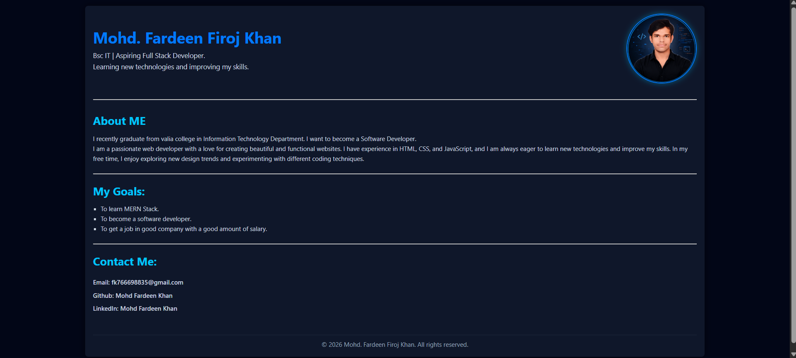

# 🌐 Portfolio Website Design

This is portfolio website built using HTML and CSS.

## 🚀 Features

- Clean and modern UI
- Flexbox layout
- Responsive design
- Sections: About, Goals, Contact

## 🛠️ Screenshots

## 🛠️ Technologies Used

- HTML5
- CSS3

## 🔗 Live Demo

[Click Here](https://Mohd-Fardeen-Khan.github.io/portfolio-website/)

## 📌 About Me

I am a BSc IT graduate and an aspiring Full Stack Developer.  
Currently learning and building projects daily.

## 📬 Contact

- Email: fk766698835@gmail.com
- GitHub: https://github.com/Mohd-Fardeen-Khan
- LinkedIn: [linkedin](https://www.linkedin.com/in/mohdfardeenkhan)
